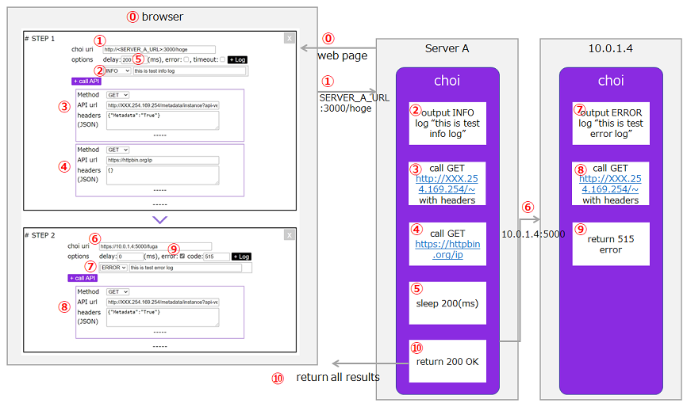

# choi

The purpose of this application is that to evaluate your infrastracture such like cloud-VMs, containers and k8s.
It's easy to create cloud infrastraucre but it's still necesarry to prepare application/middleware to check operations, network, monitoring tools on the infrastracture from the view of application layer.

"choi" (check of infrastracture) is a super simple web-application using vuejs and node-express and this app can easily relay http(s) request, call external apis and ouput custom log like below.
In short, "choi" can emulates a real application which you or your team will developed, so you can focus on your infrastracture/network/monitoring and the operation verification.


# How to setup

For each machine/vm/container
1. install nodejs
2. git clone https://github.com/shyamagu/choi.git
3. cd /choi
4. npm install
5. npm start

Then you can access a choi's setting page at this choi server (http://YOUR_SERVER_URL:3000) , any url path available /*

## Custom PORT

If you want to change PORT, please note your PORT in a "/.env" file
````
PORT=3001
````

## HTTPS server

If you want to use HTTPS, please add HTTPS configuration(PORT,pem file path, crt file path) in a "/.env" file like below.

*Not recommended, but if you want to use a self signed certification, use NODE_TLS_REJECT_UNAUTHORIZED=0 in this file.
````
...
HTTPS_PORT=5000
HTTPS_PEM=./key/your_private_key.pem
HTTPS_CRT=./key/your_server.crt
NODE_TLS_REJECT_UNAUTHORIZED=0
````

## Custom log

choi can output custom log, using log4js-node.
If you want to customize log format, rollup setting and so on, please customize "log4js.config.json" file in the root folder.

## Dockerfile sample
````
FROM node:14-alpine

# install Git & Bash
RUN apk update && apk add git && apk add bash

WORKDIR /choi

COPY . .

# yarn install
RUN yarn install

EXPOSE 3000

CMD ["./dumb-init","yarn","start"]
````

## DockerHub image for quick start

[shyamagu/choi:http](https://hub.docker.com/r/shyamagu/choi) can be used for your quick test.
This image's setting is only HTTP and opend port is 3000.

## Setup tips for Windows user

- Don't forget to open port at Windows Firewall

# How to use

"choi" is like a no-code app application. you can configure server urls, application behaviors, and call external apis and output custom log.

Below picture shows a sample setting and how to work.
Push "Send Request" button to start the process and you can see all results of calling apis and each network latency.



## Export and import setting

you can export and import setting to use "export" button and "import" button at the top of choi setting page.

An output json file includes all settings and all result.

# Evaluate your infrastracture

Using choi, you can evaluate your monitoring tool, network　communication path and the infrastracture to emulate application which has not yet been developed.

## Tips for Azure User

- try to call "http://169.254.169.254" which is an Azure Instance Metadata Service([Windows](https://docs.microsoft.com/en-us/azure/virtual-machines/windows/instance-metadata-service?tabs=linux),[Linux](https://docs.microsoft.com/en-us/azure/virtual-machines/linux/instance-metadata-service?tabs=linux)) in choi to get metadata of your infrastracure.

